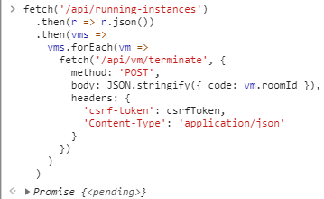
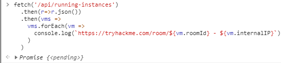
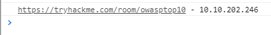
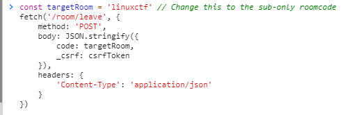

# snippets
Here are some very useful community snippets that allow you to interact with the THM API all within your browsers devtools/console

## Current Snippets:

1. Terminate all running VMs/Instances that you have deployed

1. Copy the code from the [snippet](./scripts/terminateallrunning.js)
2. Access the devtools/console of your web browser whilst logged into TryHackMe
3. Run the code within the browsers devtools/console
4. Profit

Note: you will not recieve any confirmation output, you can use the snippet below to verify that your instances have now begun terminating.

2. Check what VMs/Instances are currently deployed and the rooms they're deployed within

1. Copy the code from the [snippet](./scripts/listrunninginstances.js)
2. Access the devtools/console of your web browser whilst logged into TryHackMe
3. Run the code within the browsers devtools/console 
4. Profit

This snippet will output the instances that you have running and their IP address like below 

3. Leaving Subscriber-only rooms

1. Copy the code from the [snippet](./scripts/leavesubonlyroom.js)
2. Navigate to any other room that you have access to on TryHackMe. Ensure it is a room otherwise the snippet will fail.
3. Replace the placeholder room code `linuxctf` with the room code for the room you want to leave. The room code is found in the URL, i.e. `https://tryhackme.com/room/blue` will have the room code of `blue`

## Contributors:
With thanks to [Szymex73](https://github.com/szymex73) for snippets **1-3**
